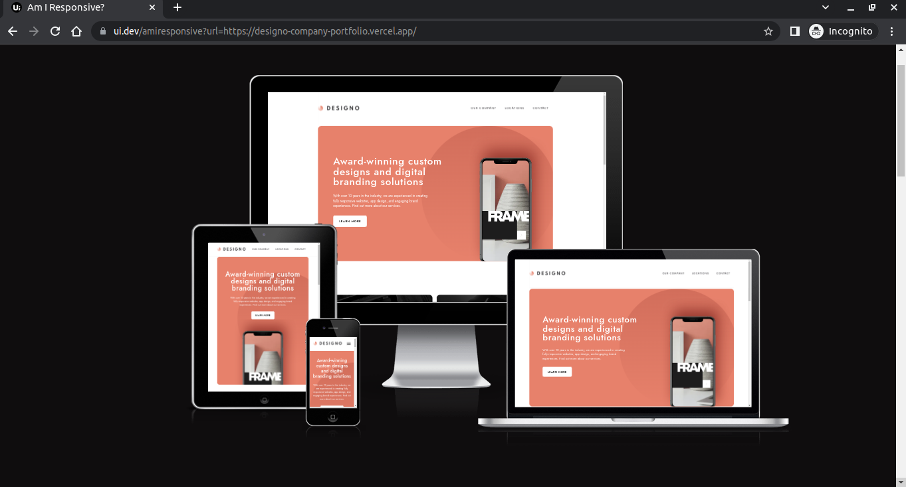

# Designo agency portfolio website

A solution to the [Designo agency website **Guru** challenge on Frontend Mentor](https://www.frontendmentor.io/challenges/designo-multipage-website-G48K6rfUT).

## Table of contents

- [The challenge](#the-challenge)
- [Screenshots](#screenshots)
- [Links](#links)
- [Built with](#built-with)
- [Getting started](#getting-started)
- [Useful resources](#useful-resources)

## Screenshots





## The challenge

Users should be able to:

- View the optimal layout for each page depending on their device's screen size
- See hover states for all interactive elements throughout the site
- Receive an error message when the contact form is submitted if:
  - The `Name`, `Email Address` or `Your Message` fields are empty should show "Can't be empty"
  - The `Email Address` is not formatted correctly should show "Please use a valid email address"
- Working email contact form intergrating with API in order to be received regarding to the website owner information (currently disabled)
- Stiky navigation bar
- SEO optimization

Soon:
- awesome animation
- **Bonus**: View actual locations on the locations page maps (we recommend [Leaflet JS](https://leafletjs.com/) for this)

### Links

- Live Site URL: [designo-company-portfolio.vercel.app](https://designo-portfolio-website.vercel.app/)
- Solution URL: [www.frontendmentor.io](https://www.frontendmentor.io/solutions/designo-multi-page-website-portfolio-mfxrYwp8Wm)

## Getting started

1. Clone the repository to your local machine from your terminal:

```
git clone https://github.com/KhaledMostafa990/designo-multi-page-company-portoflio-website.git
```

This will create a copy of the project on your local machine.

2. Navigate to the project directory:

```
cd <your-repo-name>
```

This will change your current working directory to the project directory.

3. Install the dependencies:

```
npm install
```

This will install all the necessary dependencies required for running the project.

4. Start the development server:

```
npm run dev
```
This will start the development server at http://localhost:3000.

5. Setup .env.local file to store your sercet values for contact form

For Mac

```
touch .env.local
```

For Windows

```
echo > .env.local
```

To set up your email environment variables, use placeholders and do not commit secrets:

```
SMTP_HOST=
SMTP_PORT=
SMTP_USERNAME=
SMTP_PASSWORD={{SMTP_PASSWORD}}
SMTP_FROM_ADDRESS=
SMTP_TO_ADDRESS=
```

See docs/examples/.env.frontend.example and docs/examples/.env.backend.example.

## Built with

- Semantic HTML5 markup
- CSS
- TypeScript 5
- Mobile-first workflow
- React 19 - JS library
- Next.js 15 - React framework
- Tailwind CSS 4 - CSS framework for styles
- Formik.js, libphonenumber-js and Yup - for contact form
- nodemailer.js - for send contact form information

## Useful resources

- [Elzero Web School](https://www.youtube.com/@ElzeroWebSchool) - for Arab developers
- [Maxmilian Academind ](https://www.youtube.com/@academind) - for Javascript
- [FrontendExpert & AlgoExpert](https://www.algoexpert.io/frontend) - for frontend developers
- [Meta Frontend Developer](https://www.coursera.org/professional-certificates/meta-front-end-developer) - for frontend developers
- [Dave Grey](https://www.youtube.com/@DaveGrayTeachesCode) - for Typescript
- [Traversy Media](https://www.youtube.com/@TraversyMedia) - for Javasciprt and CSS
- [TailwindCSS](https://tailwindcss.com/) - for TailwindCSS
- [Linkedin Learning](https://www.linkedin.com/learning/) - for every developers
